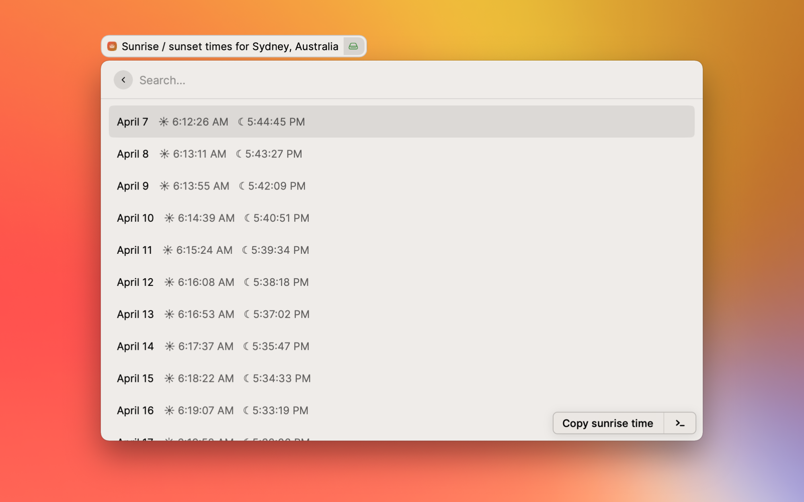
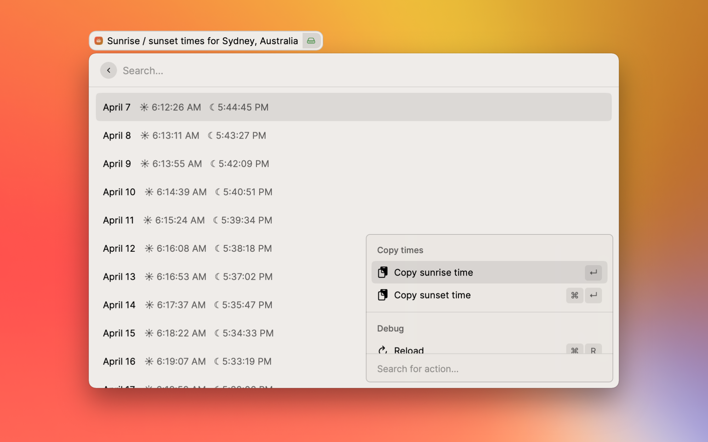

# Sunrise / Sunset Times

A Raycast extension that lets you see sunrise / sunset times at your current location for dates up to a month in the future.

## Video demo
https://user-images.githubusercontent.com/33971845/162219429-faf7638b-03ed-4c12-a9f2-facbac30b548.mp4

## Screenshots

**Commands:**

- Check Sunrise / Sunset Times: See sunrise / sunset times for dates up to a month in the future.

**Actions:**

- Copy Sunrise Time: Copy the currently selected date's sunrise time to the clipboard _(i.e. April 7 | Sunrise: 6:12:26 AM)_
- Copy Sunset Time: Copy the currently selected date's sunset time to the clipboard _(i.e. April 7 | Sunset: 5:44:45 PM)_

## How do I install it?

While the extension's undergoing [review](https://github.com/raycast/extensions/pull/1304), install it in development mode.

1. Clone the repo locally, or download and unzip.
2. Inside the extension folder, run `npm install && npm run build`.
3. Search for 'Import Extension' in Raycast and import the extension folder.
4. Type 'Check Sunrise / Sunset Times' to get started! ✨

## How does it work?

- The extension fetches your current location's latitude and longitude using IP geolocation. _This means that if you travel to a different location, the times update for your location without any configuration._
- [suncalc](https://github.com/mourner/suncalc) is used to calculate the sunrise and sunset time for each date in the future. The calculations are based on algorithms by people smarter than I am.
